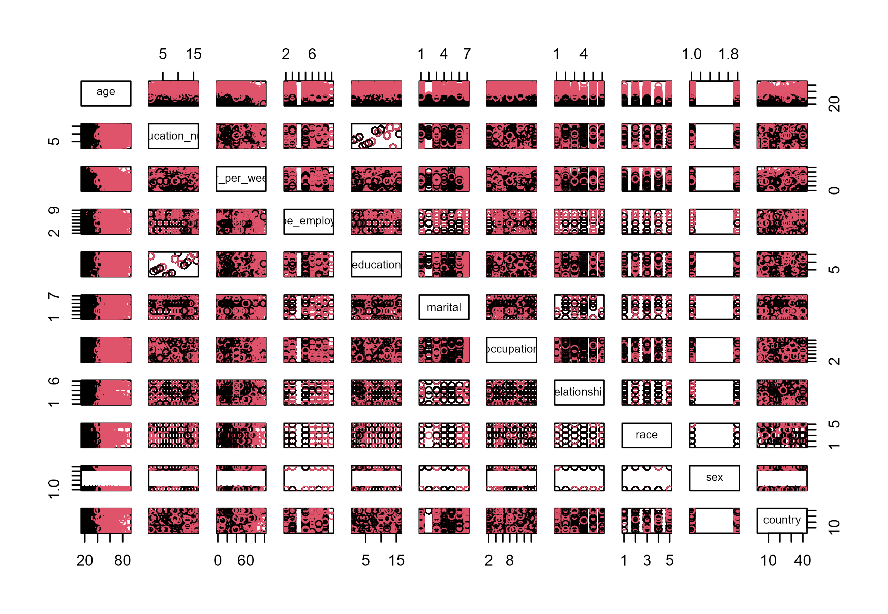

```{r setup, include=FALSE}
knitr::opts_chunk$set(echo = TRUE)
```

# Final project - Adult Census Income Level Prediction Reproduce and Research of Different Approach

## Initialise - Import Adult Dataset and Data Cleaning

### Initialise Functions

```{r}
library(OneR)
library(ggplot2)
library(dplyr)
# Function of draw the confusion matrix
draw_confusion_matrix <- function(cm, title, class1, class2) {

  layout(matrix(c(1,1,2)))
  par(mar=c(2,2,2,2))
  plot(c(100, 345), c(300, 450), type = "n", xlab="", ylab="", xaxt='n', yaxt='n')
  title(title, cex.main=2)

  # create the matrix 
  rect(150, 430, 240, 370, col='#3F97D0')
  text(195, 435, class1, cex=1.2)
  rect(250, 430, 340, 370, col='#F7AD50')
  text(295, 435, class2, cex=1.2)
  text(125, 370, 'Predicted', cex=1.3, srt=90, font=2)
  text(245, 450, 'Actual', cex=1.3, font=2)
  rect(150, 305, 240, 365, col='#F7AD50')
  rect(250, 305, 340, 365, col='#3F97D0')
  text(140, 400, class1, cex=1.2, srt=90)
  text(140, 335, class2, cex=1.2, srt=90)

  # add in the cm results 
  res <- as.numeric(cm$table)
  text(195, 400, res[1], cex=1.6, font=2, col='white')
  text(195, 335, res[2], cex=1.6, font=2, col='white')
  text(295, 400, res[3], cex=1.6, font=2, col='white')
  text(295, 335, res[4], cex=1.6, font=2, col='white')

  # add in the specifics 
  plot(c(100, 0), c(100, 0), type = "n", xlab="", ylab="", main = "DETAILS", xaxt='n', yaxt='n')
  text(10, 85, names(cm$byClass[1]), cex=1.2, font=2)
  text(10, 70, round(as.numeric(cm$byClass[1]), 3), cex=1.2)
  text(30, 85, names(cm$byClass[2]), cex=1.2, font=2)
  text(30, 70, round(as.numeric(cm$byClass[2]), 3), cex=1.2)
  text(50, 85, names(cm$byClass[5]), cex=1.2, font=2)
  text(50, 70, round(as.numeric(cm$byClass[5]), 3), cex=1.2)
  text(70, 85, names(cm$byClass[6]), cex=1.2, font=2)
  text(70, 70, round(as.numeric(cm$byClass[6]), 3), cex=1.2)
  text(90, 85, names(cm$byClass[7]), cex=1.2, font=2)
  text(90, 70, round(as.numeric(cm$byClass[7]), 3), cex=1.2)

  # add in the accuracy information 
  text(30, 35, names(cm$overall[1]), cex=1.5, font=2)
  text(30, 20, round(as.numeric(cm$overall[1]), 3), cex=1.4)
  text(70, 35, names(cm$overall[2]), cex=1.5, font=2)
  text(70, 20, round(as.numeric(cm$overall[2]), 3), cex=1.4)
}  
draw_confusion_matrix_simple <- function(cm, title, class1, class2) {

  layout(matrix(c(1,1,2)))
  par(mar=c(2,2,2,2))
  plot(c(100, 345), c(300, 450), type = "n", xlab="", ylab="", xaxt='n', yaxt='n')
  title(title, cex.main=2)

  # create the matrix 
  rect(150, 430, 240, 370, col='#3F97D0')
  text(195, 435, class1, cex=1.2)
  rect(250, 430, 340, 370, col='#F7AD50')
  text(295, 435, class2, cex=1.2)
  text(125, 370, 'Predicted', cex=1.3, srt=90, font=2)
  text(245, 450, 'Actual', cex=1.3, font=2)
  rect(150, 305, 240, 365, col='#F7AD50')
  rect(250, 305, 340, 365, col='#3F97D0')
  text(140, 400, class1, cex=1.2, srt=90)
  text(140, 335, class2, cex=1.2, srt=90)

  # add in the cm results 
  res <- as.numeric(cm)
  text(195, 400, res[1], cex=1.6, font=2, col='white')
  text(195, 335, res[2], cex=1.6, font=2, col='white')
  text(295, 400, res[3], cex=1.6, font=2, col='white')
  text(295, 335, res[4], cex=1.6, font=2, col='white')

  # add in the specifics 
  plot(c(100, 0), c(100, 0), type = "n", xlab="", ylab="", main = "DETAILS", xaxt='n', yaxt='n')
  accuracy = (res[1] + res[4]) / (res[1] + res[2] + res[3] + res[4])
  # add in the accuracy information 
  text(50, 35, 'accuracy', cex=1.5, font=2)
  text(50, 20, round(accuracy, 3), cex=1.4)
}  
```

### Read Dataset

```{r}
#Read the adult data set
adult <- read.csv(url("https://archive.ics.uci.edu/ml/machine-learning-databases/adult/adult.data"), header = FALSE,stringsAsFactors=T)

# Apply column names
colname<-c("age", "type_employer", "fnlwgt", "education", 
                "education_num","marital", "occupation", "relationship", "race","sex",
                "capital_gain", "capital_loss", "hr_per_week","country", "income")
colnames(adult)<-colname

# Continue Variable to char
varcontinue <- c("age","fnlwgt","education_num","capital_gain","capital_loss","hr_per_week")
adult <- cbind(lapply(adult[,varcontinue],function(x) as.numeric(as.character(x))),adult[,setdiff(colname,varcontinue)])
head(adult)
```

### Data Cleaning

```{r}
# Show variable type
str(adult)
```

```{r}
# Check the missing value
# table(adult$type_employer)

# Seems like the missing value is replaced by "?"
# Change the missing value to NA, which is readable for R
adult$type_employer[adult$type_employer==" ?"]<-NA
adult$occupation[adult$occupation==" ?"]<-NA
adult$country[adult$country==" ?"]<-NA

# Delete the missing value
adult_cl <- na.omit(adult)
print(nrow(adult))
print(nrow(adult_cl))
str(adult_cl)
# More than 2k data containing missing value has been deleted.
# Data clean finished
```
\newpage

## Reproduce paper result

### 1 - Using  decision  tree  classifier  to  predict  income levels [1]

Bekena using random forest to predit the income level of adult, and analysis the income level of an individual with certain attributes, and the key features determining incoming level. This section is trying to reproduce the result comes from Bekena by using the same approach.

Copy from Bekena's paper about the method section:
"A supervised machine learning approach of Random Forest Classifier is used for the study. Random forest classifier is chosen due to two reasons. First since the outcome (target) variable is binary variable (income level >50K or not), using classification algorithms is better than regression algorithms. This is because the target having only values of 0 and 1, regression algorithms will perform less due to less variation in the target variable. 
Secondly, random forest classifier is found to have better accuracy score compared to gaussian naive baise classifier. Random forest and decisionTree Classifier gave accuracy score of 85% while GaussianNB gave accuracy of 78%. Random forest is preferred to decision tree since using results from many decision trees will avoid the over fitting problem associated with using a decision tree classifier. The results from the model show that both random forest and decision tree gave similar results. This is shown by the fact that the top 7 features in importance are the same in the two models"

#### Data exploration

```{r}
# Different attributes correlation with income
# Bekena Paper Page 8
# install.packages("PerformanceAnalytics")
library("PerformanceAnalytics")

# Choose age, education_num, capital_gain, hr_per_week, income_level 
adult_cor <- adult_cl[, c("age", "education_num", "capital_gain","hr_per_week")]
# str(adult_cor)
adult_income <- adult_cl[, c("income")]
# str(adult_income)
adult_cor <- cbind(adult_cor, as.numeric(adult_income))
# str(adult_cor)

# Correlation graph
chart.Correlation(adult_cor, histogram=TRUE, pch=19)
```

The correlation graph is same as Bekena's, where the education has the highest corrlation +0.34 with income. Capital gain, age and hours worked per week are also positively correlated with income with around +0.20.

```{r}
# Plots of individuals with low and high income by different variables
# Bekena Paper Page 9

# Uncomment below if the rlang is required for higher version
## remove.packages('rlang')
## install.packages("rlang")

# Uncomment below if the Rmisc package is not found
## install.packages("Rmisc")
## install.packages("multiplot")
library(ggplot2)      
library(Rmisc)
library(plyr)
plot_indrel <- function(data, ylab, fillc, pos, xname, yname) {
  ggplot(data, aes(ylab, fill = fillc)) + 
    geom_bar(position = pos) +
    labs(x = xname, y = yname) +
    coord_flip() +
    theme_minimal()
}
# Work class
p1 <- plot_indrel(data = adult_cl, ylab = adult_cl$type_employer, fillc = adult_cl$income, 
              pos = 'fill',  xname = 'Work Class', yname = 'per count')
# Marital status
p2 <- plot_indrel(data = adult_cl, ylab = adult_cl$marital, fillc = adult_cl$income, 
              pos = 'fill',  xname = 'Marital Status', yname = 'per count')
# Occupation
p3 <- plot_indrel(data = adult_cl, ylab = adult_cl$occupation, fillc = adult_cl$income, 
              pos = 'fill',  xname = 'Occupation', yname = 'per count')
# Relationship
p4 <- plot_indrel(data = adult_cl, ylab = adult_cl$relationship, fillc = adult_cl$income, 
              pos = 'fill',  xname = 'Relationship', yname = 'per count')
# Race
p5 <- plot_indrel(data = adult_cl, ylab = adult_cl$race, fillc = adult_cl$income, 
              pos = 'fill',  xname = 'Race', yname = 'per count')
# Sex
p6 <- plot_indrel(data = adult_cl, ylab = adult_cl$sex, fillc = adult_cl$income, 
              pos = 'fill',  xname = 'Sex', yname = 'per count')
# plot(p1)
# plot(p2)
# plot(p3)
# plot(p4)
# plot(p5)
# plot(p6)
multiplot(p1, p2, p3, p4, p5, p6, cols=2)
```

```{r}
# Histogram of ages, classified by income level
ggplot(adult_cl, aes(age)) + geom_histogram(aes(fill = income), color = "black", binwidth = 1)
```
\newpage

#### Random Forest Classifier

```{r}
# Build test set and train set
income <- adult_income
## Discard fnlwgt and income, cbind numeric income
### adult_rfc <- adult_cl[, c(1, 3, 4, 5, 6, 7, 8, 9, 10, 11, 12, 13, 14, 15)]
train_rfc=sample(1:nrow(adult_cl),0.8*nrow(adult_cl))
adult_train_rfc <- adult_cl[train_rfc,]
adult_test_rfc <- adult_cl[-train_rfc,]
```

```{r}
# Uncomment below if package randomForest and caret is not found
## install.packages("randomForest")
## install.packages("caret")
library(randomForest)
library(caret)

# Start training
## Set seed avoiding randomise
set.seed(6690)
rfc_model <- randomForest(income~.-fnlwgt-relationship-marital-occupation, data = adult_train_rfc)
rfc_pred <- predict(rfc_model, adult_train_rfc, type = 'response')
varImpPlot(rfc_model)
```

```{r}
library(dplyr)
# Importance score
importance_score <- varImp(rfc_model, conditional=TRUE)
# print(importance_score)
## sum(importance_score$Overall)
proportions <- importance_score$Overall/sum(importance_score$Overall)
percentages <- proportions*100
cbind(importance_score, percentages)
```

Get the quite same result as Bekena's.

```{r}
set.seed(6690)
rfc_model2 <- randomForest(income~.-fnlwgt-relationship-occupation, data = adult_train_rfc)
rfc_pred2 <- predict(rfc_model2, adult_train_rfc, type = 'response')
## varImpPlot(rfc_model2)
# Importance score
importance_score2 <- varImp(rfc_model2, conditional=TRUE)
# print(importance_score2)
## sum(importance_score$Overall)
proportions2 <- importance_score2$Overall/sum(importance_score2$Overall)
percentages2 <- proportions2*100
cbind(importance_score2, percentages2)
```
The reason that the attribute "marital" is higher than expected is that, in Bekena's paper, marital status "married" is listed separated, which cause the different value with my result.

```{r}
# Validate through test data set
rfc_pred_test <- predict(rfc_model, adult_test_rfc, type = 'response')
eval_model(rfc_pred_test, adult_test_rfc)
```

```{r}
rfc_cm <- confusionMatrix(rfc_pred_test, adult_test_rfc$income)
draw_confusion_matrix(rfc_cm, "Confusion Matrix For Random Forest", "<=50K", ">50K")
## rfc_pred_test
## adult_test_rfc
```
\newpage

### 2 - A Comparative Study of Classification Techniques On Adult Data Set [2]

Deepajothi and Selvarajan used multiple classification algorithms to predict the income level using adult data set[2], including Naive Bayesian, KNN, Random forest and Zero R. The result they provided is that the naive bayesian should had the highest accuracy. Now we are trying to reproduce the result. Note that the RF algorithm is reproduced in the previous paper, so in this section other three algorithms will be reproduced.

#### Naive Bayesian

```{r}
library(naivebayes)
# Random split the data set into 0.8 -> training, 0.2 -> testing
set.seed(6690)
train_nb=sample(1:nrow(adult_cl),0.8*nrow(adult_cl))
adult_train_nb <- adult_cl[train_nb,]
adult_test_nb <- adult_cl[-train_nb,]
# Delete the column fnlwgt
adult_train_nb <- adult_train_nb[,-2]
adult_test_nb <- adult_test_nb[,-2]
# Naive Bayes Algorithm
nb_model <- naive_bayes(income~., data = adult_train_nb, laplace = 1)
## print(nb_model)
## plot(nb_model)
nb_pred <- predict(nb_model, adult_train_nb, type = 'prob')
```

```{r}
# Validate on testing data set
nb_pred_test <- predict(nb_model, adult_test_nb)
eval_model(nb_pred_test, adult_test_nb)
```

```{r}
# Confusion Matrix
nb_cm <- confusionMatrix(data=nb_pred_test, reference=adult_test_nb$income)
draw_confusion_matrix(nb_cm, "Confusion Matrix For Naive Bayesian", "<=50K", ">50K")
```
\newpage

#### K-means clustering (K Star)

In the paper [2], they are using an algorithm called "K Star", which I can only found several information in Google. Luckily, the chatGPT tells me that the K star is a variant of the KNN algorithm, where K Star is used for clustering and KNN is used for classification. After more digging the example code from chatGPT I found that, the K star "should be" the previous name of K-means algorithm. So in this section, I will use K-means clustering to reproduce the result.

```{r}
library(cluster)
library(dplyr)
# Random split the data set into 0.8 -> training, 0.2 -> testing
set.seed(6690)
adult_km <- adult_cl[,c(-2, -4, -5, -15)]
adult_km <- adult_km %>% mutate_at(c('type_employer', 'education', 'marital', 'occupation', 'relationship', 'race', 'sex', 'country'), as.numeric)
km_model <- kmeans(adult_km, centers = 2, nstart = 30)
km_cm <- table(adult_cl$income, factor(km_model$cluster))
draw_confusion_matrix_simple(km_cm, "Confusion Matrix For K-means Clustering", "<=50K", ">50K")
```

The K-means algorithm is unsupervised, so no need to split training and testing subset.

```{r, results="hide"}
# To see the plot, un-comment the code below, but DO NOT try to knit with this chunk
## plot(adult_km,col=km_model$cluster)
# Here is the screenshot of the code above
```

```{r, fig.cap="K-Means plot", out.width = '100%'}

```
\newpage

```{r}
sprintf("The accuracy for predicting income <=50K: %f", km_cm[1]/22654)
sprintf("The accuracy for predicting income >50K: %f", 1-km_cm[2]/7508)
sprintf("The total accuracy for predicting income: %f", (km_cm[1]+7508-km_cm[2])/30162)
```
\newpage

#### Zero R

```{r}
library(OneR)
adult_zr <- adult_cl[,c(-2)]
train_zr=sample(1:nrow(adult_zr),0.8*nrow(adult_zr))
adult_train_zr <- adult_zr[train_zr,]
adult_test_zr <- adult_zr[-train_zr,]
zr_model <- OneR(cbind(dummy = TRUE, adult_train_zr))
class(zr_model) <- "OneR"
zr_pred <- predict(zr_model, cbind(dummy = TRUE, adult_test_zr))
eval_model(zr_pred, adult_test_zr)
```

```{r}
zr_cm <- confusionMatrix(zr_pred, adult_test_zr$income)
draw_confusion_matrix(zr_cm, "Confusion Matrix For Zero R", "<=50K", ">50K")
```

```{r}
sprintf("Accuracy for Random Forest: %f", rfc_cm$overall[1])
sprintf("Accuracy for Naive Bayesian: %f", nb_cm$overall[1])
sprintf("Accuracy for K-Means: %f", (km_cm[1]+7508-km_cm[2])/30162)
sprintf("Accuracy for Zero R: %f", zr_cm$overall[1])
```
Got the similar result with S.deepajothi, D. s selvarajan [2], where Random Forest and Naive Bayesian has the relative higher accuracy than K-means and Zero R. The result may because of the high accuracy for Naive Bayesian and Random Forest classifier when dealing with the large scale data set. However, K-means as unsupervised learning, learn from un-tagged dataset. Although dimensionality reduction was already done in the code, the high dimension still drag the accuracy. I also tried to implement K-means on the dataset with few dimensions, the accuracy is much higher than more dimensions. Zero R is a naive approach to classify a datase, which based on target and ignores other independent attributes, so it brings fast computing with relative low accuracy.

\newpage

## Another Approach - Logistic Regression and SVM

### Logistic Regression

Logistic Regression use several independent variables to predict categorical dependent variables. In this section, I will use Logistic Regression to build the model and predict the income level in order to see the accuracy.

```{r}
library(caret)
# Random split the data set into 0.8 -> training, 0.2 -> testing
train_lr=sample(1:nrow(adult_cl),0.8*nrow(adult_cl))
adult_train_lr <- adult_cl[train_lr,]
adult_test_lr <- adult_cl[-train_lr,]
# Delete the column fnlwgt
adult_train_lr <- adult_train_lr[,-2]
adult_test_lr <- adult_test_lr[,-2]
# Train the logistic regression model
lr_model <- glm(income ~., data = adult_train_lr, family = binomial('logit'))
summary(lr_model)
```
\newpage

```{r}
library(ggplot2)
# Print the income level percentage histogram of test data set
ggplot(adult_test_lr) + aes(x=as.numeric(age), group=income, fill=income) + 
  geom_histogram(binwidth=1, color='black')+labs(x="Age",y="Number of People")
```
\newpage

```{r}
# Predict the result from test data set 
lr_pred <- predict(lr_model, adult_test_lr, type = 'response')
lr_y_pred <- rep('<=50K', length(lr_pred))
lr_y_pred[lr_pred>=.5] <- '>50K'
# confusion matrix 
lr_cm<- table(lr_y_pred, adult_test_lr$income)
draw_confusion_matrix_simple(lr_cm, "Confusion Matrix For Logistic Regression", "<=50K", ">50K")
```
\newpage

```{r}
library(ROCR)
# Plot ROC curve
lr_roc_pred <- prediction(lr_pred, adult_test_lr$income)
lr_performance <- performance(lr_roc_pred, measure = "tpr", x.measure = "fpr")
plot(lr_performance,colorize=T,print.cutoffs.at=seq(0.1,by=0.05),main="ROC Graph")
```
\newpage

### SVM

The Support Vector Machine can be used to classify the dataset into two groups, which is fit for the adult dataset. The SVM with the principle of a maximum marginal classifier, and a multi-dimensional space to classify data points since the SVM generates a hyperplane in an multi-dimensional space. In this section, I will use the SVM classifier to build the model and predict the income level in order to see the accuracy of SVM. 

```{r}
library(ISLR)
library(e1071)
set.seed(6690)
# Random split the data set into 0.8 -> training, 0.2 -> testing
train_svm=sample(1:nrow(adult_cl),0.8*nrow(adult_cl))
adult_train_svm <- adult_cl[train_svm,]
adult_test_svm <- adult_cl[-train_lr,]
# Delete the column fnlwgt
adult_train_svm <- adult_train_svm[,-2]
adult_test_svm <- adult_test_svm[,-2]
# Train the SVM model
svm_model = svm(income ~ .,data = adult_train_svm)
summary(svm_model)
```
```{r}
# Prediction
svm_pred = predict(svm_model, newdata=adult_test_svm, type="response")
eval_model(svm_pred, adult_test_svm)
```
```{r}
# confusion matrix 
svm_cm <- confusionMatrix(svm_pred, adult_test_svm$income)
draw_confusion_matrix(svm_cm, "Confusion Matrix For SVM", "<=50K", ">50K")
```
\newpage

## References
[1] Sisay  Menji  Bekena:“Using  decision  tree  classifier  to  predict  income levels”, Munich Personal RePEc Archive 30th July, 2017

[2] S.deepajothi, D. s selvarajan. (2012). A Comparative Study of Classification Techniques On Adult  Data Set. International Journal of Engineering Research, 1(8), 8.